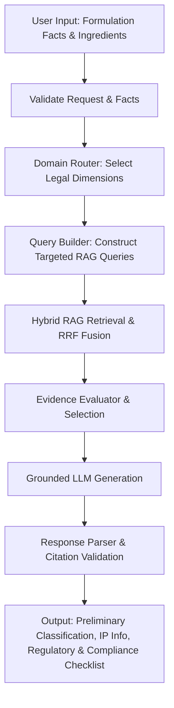
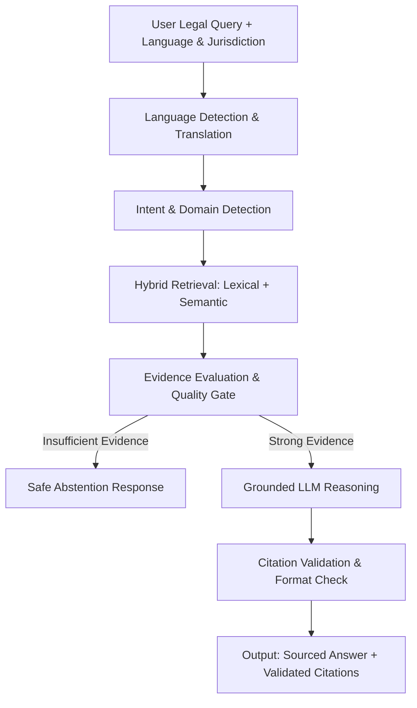
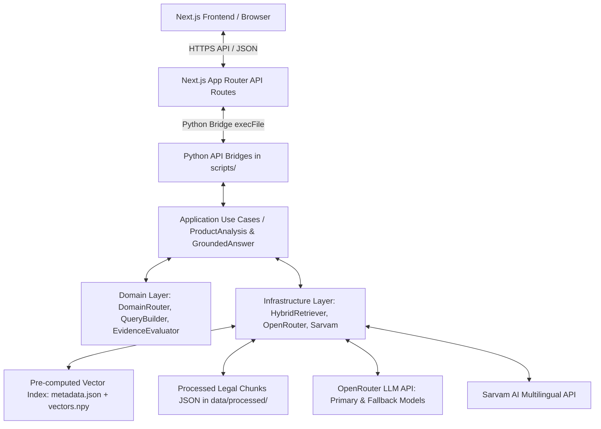

# AYUSHYA — AI-Powered IP & Regulatory Intelligence for Ayurveda

AYUSHYA is a multilingual, RAG-based, source-cited AI assistant for Intellectual Property (IP) and regulatory guidance in Ayurveda, built for **Smart India Hackathon 2026 (Problem Statement SIH26045: IP-SAKTI Sahayak)** under the Ministry of Ayush.

---

## 1. Problem Statement

Ayurveda innovators, research institutions, startups, and practitioners face significant challenges when navigating IP protection and regulatory compliance in India and internationally:

- **Fragmented Statutory Frameworks**: Relevant legal guidance is spread across multiple distinct bodies and statutes, including the Patents Act, Trade Marks Act, Geographical Indications of Goods Act, Copyright Act, Designs Act, Drugs & Cosmetics Act, Drugs & Magic Remedies Act, FSSAI Ayurveda-Aahara Regulations, and the Biological Diversity Act.
- **Overlapping Regulatory Regimes**: Determining whether an Ayurvedic product qualifies as a Classical ASU Formulation, Proprietary Ayurvedic Medicine, Ayurveda-Aahar, Nutraceutical, Phytopharmaceutical, or Cosmetic requires analyzing ingredient compositions, manufacturing methods, and health/disease claim flags.
- **Language Barriers**: Legal texts and gazette notifications are published in official legal English/Hindi, whereas innovators across India communicate in regional languages such as Telugu and Hindi.
- **Access & Benefit Sharing (ABS) & Traditional Knowledge (TK)**: Use of Indian biological resources triggers mandatory notification/approval from the National Biodiversity Authority (NBA) and scrutiny against the Traditional Knowledge Digital Library (TKDL) to prevent patent rejection under Sections 3(p) and 3(e) of the Patents Act, 1970.
- **Hallucination Risk in AI**: Standard LLMs frequently fabricate section numbers, cite non-existent court precedents, or generate overconfident legal advice without evidence.

---

## 2. Proposed Solution

AYUSHYA addresses these challenges by providing a source-grounded, multi-agent AI assistant and formulation analyzer that:

1. **Retrieves Authoritative Legal Evidence**: Queries a curated corpus of official Indian Acts, Rules, Regulations, and international treaties using hybrid RAG (lexical TF-IDF + 384-dim semantic embeddings with RRF fusion).
2. **Evaluates Evidence Strength Deterministically**: Scores retrieved chunks against statutory hierarchy and query intent, abstaining safely when evidence is insufficient rather than fabricating answers.
3. **Validates All Citations**: Enforces strict 1-to-1 citation mapping against validated evidence chunks, ensuring every legal statement links directly to its source metadata.
4. **Supports Preliminary Product Classification**: Evaluates user-submitted formulation facts (form, claims, ingredients, classical basis) to suggest preliminary regulatory categories with explicit verification caveats.
5. **Generates Itemized Compliance Checklists**: Translates complex legal requirements into actionable, prioritized compliance steps.
6. **Delivers Multilingual Interaction**: Enables natural interaction in English, Hindi, and Telugu (using Sarvam AI) while anchoring retrieval and citation to authoritative source texts.

---

## 3. Key Features

- **Product/Formulation Analyzer**: Evaluates formulation inputs against Ayurveda-Aahara, ASU drug, and phytopharmaceutical criteria.
- **AI Legal Assistant**: Conversational interface anchored strictly to retrieved evidence.
- **Multilingual Support**: Supports queries and explanations in English, Hindi, and Telugu with native script output and Romanized Telugu transliteration.
- **Hybrid RAG Engine**: Combines keyword matching and semantic vector search with Reciprocal Rank Fusion (RRF).
- **Source-Cited Answers**: Every substantive assertion includes validated citation IDs traceable to official gazette chunks.
- **Evidence Evaluation & Safe Abstention**: Evaluates chunk quality and automatically abstains with clear reasoning when corpus evidence is weak or missing.
- **Jurisdiction-Aware Filtering**: Explicitly separates Indian law (`India`) from international frameworks (`International` - TRIPS, CBD, Nagoya Protocol, PCT, WIPO GRATK).
- **Multi-Domain Intent Routing**: Automatically routes queries across Patent, Trademark, GI, Copyright, Design, Regulatory, and Biodiversity legal domains.
- **Itemized Compliance Checklist**: Generates prioritized checklist items for licensing, packaging, labeling, and NBA ABS notifications.

---

## 4. User Flow

### Product Analysis Flow


### AI Assistant Query Flow


---

## 5. System Architecture



---

## 6. Technical Implementation

### Tech Stack
- **Frontend**: Next.js 15 (App Router), React 19, TypeScript 5.7, Tailwind CSS v4, Motion, Lucide Icons.
- **Backend / Bridge**: Node.js Next.js API Routes spawning Python 3 sub-processes via `child_process.execFile`.
- **RAG Engine**:
  - **Lexical Retrieval**: Custom Python TF-IDF ranker over processed legal JSON chunks.
  - **Semantic Retrieval**: `sentence-transformers` (`all-MiniLM-L6-v2`, 384 dimensions) with NumPy vector store (`vectors.npy`).
  - **Fusion**: Reciprocal Rank Fusion (RRF) combining lexical and semantic rankings.
  - **Evaluation & Selection**: Deterministic evidence evaluator scoring chunk relevance, domain alignment, and metadata completeness.
- **LLM Provider**: OpenRouter API (`mistralai/mistral-small-24b-instruct-2501` with fallback to `meta-llama/llama-3.3-70b-instruct` and `nvidia/nemotron-3-super-120b-a12b`).
- **Multilingual Pipeline**: Sarvam AI API for Hindi/Telugu translation and Telugu transliteration.

---

## 7. Legal Corpus & Data Sources

The AYUSHYA RAG knowledge base contains **approximately 9,206 structured legal chunks** curated from official level-1 and level-2 statutory sources:

### Indian IP Frameworks
- **Patents**: *The Patents Act, 1970*, *The Patents Rules, 2003 (Consolidated 2024)*, *Guidelines for Examination of Patent Applications Relating to AYUSH / Traditional Knowledge Inventions (2025)*.
- **Trademarks**: *The Trade Marks Act, 1999*, *The Trade Marks Rules, 2017*.
- **Geographical Indications**: *The Geographical Indications of Goods (Registration and Protection) Act, 1999*, *Rules, 2002*.
- **Copyright**: *The Copyright Act, 1957*, *The Copyright Rules, 2013 (Amended 2021)*.
- **Designs**: *The Designs Act, 2000*, *The Designs Rules, 2001 (Amended 2021)*.

### AYUSH & Regulatory Frameworks
- **AYUSH & Drugs**: *The Drugs and Cosmetics Act, 1940*, *The Drugs and Cosmetics Rules, 1945 (Consolidated to 2024)*, *The Drugs and Magic Remedies (Objectionable Advertisements) Act, 1954 & Rules, 1955*.
- **Food & Supplements**: *Food Safety and Standards (Ayurveda Aahara) Regulations, 2022*, *FSSAI Ayurveda-Aahar Order, 2025*.

### Biodiversity & Traditional Knowledge
- **Biological Diversity**: *The Biological Diversity Act, 2002*, *Biological Diversity Rules, 2024 (Amended 2025)*, *Guidelines on Access to Biological Resources and Associated Knowledge and Equitable Benefit Sharing Regulations, 2025*.

### International Frameworks
- *TRIPS Agreement (1994)*, *Patent Cooperation Treaty (PCT, 1970)*, *Convention on Biological Diversity (CBD, 1992)*, *Nagoya Protocol on Access and Benefit-Sharing (2010)*, *WIPO GRATK Treaty on Intellectual Property, Genetic Resources and Associated Traditional Knowledge (2024)*.

---

## 8. Evidence Evaluation & Legal Safety

1. **Grounded-Only Generation**: Prompts instruct the LLM to answer using *only* retrieved evidence chunks.
2. **Strict Citation Validation**: Citation IDs returned in answers are filtered against the exact retrieved chunks provided in context. Unmatched or fabricated citations are stripped.
3. **Safe Abstention**: If hybrid retrieval produces low evidence scores or zero matching chunks, the engine returns a safe abstention notice with explicit reasons instead of guessing.
4. **Preliminary Disclaimer**: All product classification and IP relevance assessments are explicitly labeled as **preliminary, AI-assisted guidance** requiring professional verification. AYUSHYA does not provide formal legal opinions or grant statutory approvals.

---

## 9. Local Development & Setup

### Prerequisites
- Node.js v18+ and npm
- Python 3.10+ with `pip` and virtual environment support

### Installation
1. Clone the repository:
   ```bash
   git clone https://github.com/rohithssj/Ayushya.git
   cd Ayushya
   ```

2. Setup Node.js frontend dependencies:
   ```bash
   npm install
   ```

3. Setup Python backend virtual environment:
   ```bash
   python -m venv .venv
   # Windows:
   .venv\Scripts\activate
   # Linux/macOS:
   source .venv/bin/activate

   pip install -r requirements-rag.txt
   ```

4. Configure Environment Variables:
   ```bash
   cp .env.example .env.local
   ```
   *Edit `.env.local` to insert your `OPENROUTER_API_KEY` and optional `SARVAM_API_KEY`.*

5. Run Development Server:
   ```bash
   npm run dev
   ```
   Open `http://localhost:3000` in your browser.

---

## 10. Environment Variables

| Variable Name | Environment | Description | Required / Optional |
|---|---|---|---|
| `OPENROUTER_API_KEY` | Server-side only | API key for OpenRouter LLM inference | **Required** |
| `SARVAM_API_KEY` | Server-side only | API key for Sarvam AI Indian language translation | Optional (enables Hindi/Telugu UI localizer) |
| `LLM_MODEL` | Server-side only | Primary OpenRouter model string | Optional (Default: `mistralai/mistral-small-24b-instruct-2501`) |
| `LLM_FALLBACK_MODELS` | Server-side only | Comma-separated fallback models | Optional (Default: `meta-llama/llama-3.3-70b-instruct,nvidia/nemotron-3-super-120b-a12b`) |
| `LLM_TIMEOUT_SECONDS` | Server-side only | Timeout in seconds for LLM call | Optional (Default: `25`) |

---

## 11. Testing & Benchmark Results

Run full test suites using the following commands:

```bash
# Product Analysis Tests (60 tests)
.venv\Scripts\python.exe -m unittest discover -s src/features/product-analysis/tests

# RAG & Grounded Answer Tests (132 tests)
.venv\Scripts\python.exe -m unittest discover -s src/features/rag/tests

# Multilingual Tests (9 tests)
.venv\Scripts\python.exe -m unittest src/features/rag/tests/test_multilingual.py

# Frontend Build & Typecheck
npm run typecheck
npm run build
```

### Verified Test Metrics
- **Product Analysis Test Suite**: `60/60 PASS` (Covers classification, domain router, query builder, parser validators, BioShield regression).
- **RAG Test Suite**: `132/132 PASS` (Covers lexical retrieval, semantic embeddings, RRF fusion, evidence evaluator, citation builder, safe abstention).
- **Multilingual Test Suite**: `9/9 PASS` (Covers Telugu, Hindi, Romanized Telugu, and English translation/transliteration preservation).
- **RAG Benchmark Suite**: `23/23 PASS` (100% pass rate on the current 23-case benchmark suite covering Indian and international legal scenarios; note: benchmark coverage is finite and does not guarantee universal legal correctness).

---

## 12. Deployment Architecture

```
Frontend (Next.js App Router)  ──>  Deployed on Vercel
Backend (Node API + Python)     ──>  Deployed on Railway / Render
Storage & Index                ──>  Bundled in container / persistent disk
```

### Recommended Deployment Steps
1. **Backend Service (Railway)**:
   - Deploy backend environment with Python 3.10+ runtime.
   - Set environment variables: `OPENROUTER_API_KEY`, `SARVAM_API_KEY`, `PORT`.
   - Verify health endpoint at `GET /api/health`.
2. **Frontend Service (Vercel)**:
   - Deploy Next.js repository to Vercel.
   - Configure `OPENROUTER_API_KEY` and `SARVAM_API_KEY` in Vercel environment settings.

---

## 13. System Limitations

- **Preliminary AI Assistance**: AYUSHYA outputs are designed for decision-support and research guidance. They do not constitute formal legal advice or binding regulatory determinations.
- **Finite Corpus Coverage**: Analysis is grounded in the ingested 9,206 statutory chunks; statutes or state-level circulars outside this index require manual verification.
- **International Destination Sensitivity**: International product classification requires explicit specification of the target destination country for market category determination.
- **Dynamic Regulatory Updates**: Gazette amendments issued after corpus indexing require offline re-chunking and index updates.

---

## 14. Future Roadmap

- **Expanded Global Corpus**: Integration of US FDA (NDI/GRAS), EU Novel Food Regulations, and TGA Australia herbal import rules.
- **Automated Gazette Monitoring**: Scheduled scraping pipeline to ingest and index newly published AYUSH & FSSAI notifications.
- **Expert Review Portal**: Escalation workflow allowing innovators to submit preliminary AI analyses directly to certified IP attorneys or AYUSH regulatory consultants.
- **Formulation Document Parser**: Direct upload and automated ingredient extraction from formulation PDFs or batch records.

---

## 15. Team & Acknowledgments

Built with dedication for **Smart India Hackathon 2026** under **Problem Statement SIH26045 (IP-SAKTI Sahayak)**.

- **Project Name**: AYUSHYA
- **Target Ministry**: Ministry of Ayush, Government of India
- **Repository**: [github.com/rohithssj/Ayushya](https://github.com/rohithssj/Ayushya)